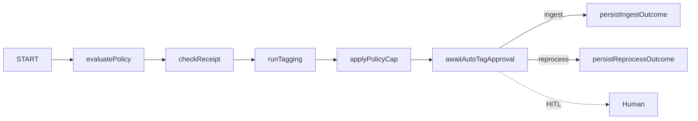

# Orchestrator walkthrough

This guide explains how **tagging** flows through the LangGraph orchestrator — not a single LLM call, but a deterministic pipeline with optional HITL and ERP side effects.

## Mental model

| Layer | Responsibility |
|-------|----------------|
| **Policy engine** | Compiled rules → `FLAG_RECEIPT`, vendor blocks, caps |
| **Tagging agent** | LLM + retrieval → GL suggestion, confidence, support |
| **Tri-state gate** | `AUTO_TAG` \| `QUEUE_REVIEW` \| `REFUSE` (`src/lib/orchestrator/gates.ts`) |
| **LangGraph** | Ordered nodes, Postgres checkpointer, optional interrupt before persist |
| **Persist** | DB updates, review queue sync, mock ERP on `AUTO_TAG` |

Graph definition: `src/lib/orchestrator/langgraph/tagging-graph.ts`.



## Node-by-node

1. **evaluatePolicy** — Loads active policy pack; may set receipt requirement or block before tagging.
2. **checkReceipt** — If policy requires a receipt and none is cleared → `receiptBlocked` (forces review path).
3. **runTagging** — Calls tagging agent (LLM when enabled); produces GL + confidence.
4. **applyPolicyCap** — Merges policy outcome with tagging; runs tri-state gate.
5. **awaitAutoTagApproval** — When `AUTO_TAG_HITL_ENABLED=true`, interrupts for human approve/deny.
6. **persistIngestOutcome / persistReprocessOutcome** — Writes decision, events, queue row; may auto-post to mock ERP.

## Demo path: AWS $99 → receipt → AUTO_TAG

Use **tenant-a** (seeded AWS vendor rule). Run from repo root:

```bash
pnpm db:migrate
pnpm db:seed
pnpm demo
```

Or in the UI:

1. Ingest **AWS**, **$99**, memo `ec2` → expect **QUEUE_REVIEW** / `FLAG_RECEIPT`.
2. Upload a receipt on the transaction detail page (clears receipt gate).
3. Click **Reprocess tagging** → expect **AUTO_TAG** (and ERP panel if mock adapter is on).

CLI equivalent is steps 2–3 in `scripts/demo.ts` (insert receipt + `reprocessTransactionTagging`).

## Slack $55 — HITL

With `AUTO_TAG_HITL_ENABLED=true`, Slack $55 may return `pending_approval`. Approve via UI, `POST /api/transactions/.../approve-auto-tag`, MCP `approve_auto_tag`, or demo step 1b (`resumeAutoTagApproval`).

## Tri-state outcomes

| Decision | Typical trigger |
|----------|-----------------|
| `AUTO_TAG` | Confidence + support thresholds; receipt cleared; GL in COA |
| `QUEUE_REVIEW` | Receipt required, parse failure, injection guard, below threshold |
| `REFUSE` | Unknown vendor pattern, COA mismatch |

## Common pitfalls

- **Wrong tenant** — AWS receipt rule is on **tenant-a**, not tenant-b.
- **Receipt without reprocess** — Upload alone does not re-run the graph; reprocess explicitly.
- **`llm_parse_failed`** — Often missing/invalid LLM API key or model; check `.env` (`LLM_MODEL`, provider keys).
- **Duplicate ingest** — Same `external_transaction_id` returns duplicate status (by design).

## Related surfaces

| Surface | Entry |
|---------|--------|
| UI orchestrator trace | `/orchestrator` |
| REST | `POST /api/transactions/ingest`, `.../reprocess`, `.../receipt` |
| MCP | `pnpm mcp` — see `docs/mcp-setup.md` |
| AP (separate graph) | `runApPipeline` — recommend-only, no auto-pay |

## Further reading

- `STRATEGY.md` — product boundaries
- `docs/product-roadmap.md` — module status
- `scripts/demo.ts` — full E2E script (tagging + override + AP duplicate)
