# ReconAI v2 — Agentic Evidence Implementation Plan

| Field | Value |
|-------|--------|
| **Status** | Approved for `develop` branch |
| **Branch policy** | `main` frozen for Jun 14 capstone showcase; all v2 work on `develop` |
| **Author / audience** | Implementation + interview narrative |
| **Last updated** | 2026-06-09 |

---

## Executive summary

ReconAI v1 is a **governed orchestrated pipeline**: LangGraph runs policy → receipt gate → tagging (rule-first → always retrieve → LLM → deterministic confidence → tri-state gate). It is strong on **Level 3** (eval, audit, review queue, observability) but weak on **Level 2** (dynamic evidence / tool routing).

**v2 goal:** Add **agentic evidence gathering** — the system decides *which* tools to run and *when* to skip retrieval — without removing deterministic gates or policy evaluation.

**Delivery strategy:** Feature-flagged incremental phases on `develop`. Default flag **off** preserves v1 byte-for-byte behavior. Merge to `main` only after showcase (Jun 14+) or via cherry-pick if eval stays green.

---

## 1. Problem statement

### 1.1 Interview feedback (decoded)

Interviewers are not asking for a new framework. They want proof of:

```text
Systems where the LLM (or planner) makes decisions about
what evidence to gather before acting — not fixed retrieve-then-answer.
```

### 1.2 Current v1 tagging path

**File:** `src/lib/agents/tagging/run-tagging-agent.ts`

```text
vendor_normalize
  → vendor_rule_lookup (may skip LLM later)
  → ALWAYS embed + retrieve_similar_transactions(top_k=5)
  → suggestTagging (LLM structured JSON, or skip if rule_hit)
  → scoreConfidence (deterministic)
  → applyTriStateGate (deterministic)
```

**LangGraph wrapper:** `src/lib/orchestrator/langgraph/tagging-graph.ts`

```text
evaluatePolicy → checkReceipt → runTagging → applyPolicyCap → awaitAutoTagApproval → persist
```

### 1.3 Gap analysis

| Capability | v1 today | v2 target |
|------------|----------|-----------|
| Rule-first LLM skip | ✅ `canSkipLlm` when vendor rule hits | Keep |
| Conditional retrieval | ❌ Always top-5 | Skip when rule + known vendor sufficient |
| Tool routing | ❌ Fixed pipeline | Planner selects tools |
| Reflection / verifier | ❌ | Heuristic + optional LLM challenge |
| Deterministic gates | ✅ `src/lib/orchestrator/gates.ts` | **Unchanged** |
| Policy at txn time | ✅ TS evaluator | **Unchanged** |
| Eval harness | ✅ `pnpm eval:tagging` | Extend metrics |
| Pipeline trace | ✅ `emitPipelineTraceStep` | New planner/verifier steps |

### 1.4 What we will NOT claim

- “Fully autonomous multi-agent platform with four named agents” (overkill for scope)
- “LLM decides AUTO_TAG without gates” (violates finance invariant)
- Replacing `main` demo before showcase without eval sign-off

---

## 2. Goals and success criteria

### 2.1 Primary goals

1. **Dynamic evidence:** Retrieval and auxiliary lookups run only when the evidence plan says they are needed.
2. **Interview narrative:** Demonstrable tool-routing with traces and eval cases.
3. **Safety:** `REFUSE` / `QUEUE_REVIEW` rates do not silently worsen; auto precision ≥ 95% on held-out eval (same bar as README).
4. **Isolation:** `AGENTIC_EVIDENCE_ENABLED=false` → identical v1 behavior.

### 2.2 Success metrics

| Metric | Baseline (v1) | v2 acceptance |
|--------|---------------|---------------|
| `pnpm eval:tagging` auto precision | ≥ 95% | ≥ 95% (no regression > 2pp) |
| `pnpm demo` | All steps pass | All steps pass |
| Retrieval skip rate (new) | 0% | > 0% on rule-hit cases |
| Planner invocation (new) | N/A | 100% when flag on |
| Avg LLM calls per txn | 0–1 | ≤ 2 (planner + tagging; verifier heuristic default) |
| Unit tests | Green | +15 new cases minimum |

### 2.3 Interview talking points (post v2)

- **Tool use:** Evidence planner outputs `tools[]`; orchestrator executes selected tools only.
- **Tool overuse prevention:** Deterministic overrides force retrieval for new vendors; rule-hit path skips RAG.
- **When agents stop:** Confidence thresholds + tri-state gate unchanged.
- **Evaluation:** Golden eval + new agentic cases in `eval/tagging_eval.jsonl`.
- **Debug failures:** Pipeline trace shows planner rationale, per-tool status, verifier notes.
- **Governance:** Review queue + HITL + policy cap unchanged.

---

## 3. Scope

### 3.1 In scope

- Feature flag `AGENTIC_EVIDENCE_ENABLED`
- Conditional retrieval policy (Phase 1)
- Evidence planner + tool execution (Phase 2)
- Heuristic verifier (Phase 3)
- Trace + eval extensions (Phase 4)
- Unit tests for all new modules

### 3.2 Out of scope (v2)

- LangGraph graph restructure (optional Phase 2b — defer)
- New database tables / migrations
- LLM policy evaluation at transaction time
- Removing or softening tri-state gates
- MCP / UI redesign
- Merging to `main` before Jun 14 (default)

### 3.3 Non-negotiable invariants

From `cfo-capstone.mdc` and `STRATEGY.md`:

- Silent miscoding worse than refusal → gates stand
- One orchestrator owns workflow state
- Per-tenant isolation on every query
- Zod validation on all new LLM JSON boundaries
- Parse failure → `QUEUE_REVIEW`, never implicit `AUTO_TAG`

---

## 4. Target architecture

### 4.1 v2 tagging flow (flag on)

```text
┌─────────────────────────────────────────────────────────────────┐
│ runTaggingAgent (src/lib/agents/tagging/run-tagging-agent.ts)   │
├─────────────────────────────────────────────────────────────────┤
│ 1. vendor_normalize                                             │
│ 2. vendor_rule_lookup                                           │
│ 3. [NEW] plan_evidence (LLM, 1 call, Zod)                       │
│ 4. [NEW] execute_evidence_tools (conditional):                  │
│      • vendor_rules      — already resolved in step 2           │
│      • similar_txns      — pgvector (conditional)               │
│      • policy_context    — deterministic policy summary         │
│      • invoice_match     — optional AP cross-ref (stub OK)      │
│ 5. suggestTagging (LLM or skip if rule-first)                   │
│ 6. [NEW] verify_evidence (heuristic; optional LLM)              │
│ 7. scoreConfidence (deterministic)                              │
│ 8. applyTriStateGate (deterministic)                            │
└─────────────────────────────────────────────────────────────────┘
```

### 4.2 Tool catalog

| Tool ID | Implementation | LLM? | When selected |
|---------|----------------|------|---------------|
| `vendor_rules` | `lookupVendorRule` | No | Always when `vendor_id` present |
| `similar_transactions` | `retrieveSimilarTransactions` | No (embed may use API) | New vendor, no rule, weak prior |
| `policy_context` | Summary from last `PolicyEvaluated` / active pack | No | Receipt/MCC/high amount flags |
| `invoice_match` | Query `invoices` by vendor (seed data) | No | Optional; vendor has AP history |

### 4.3 Deterministic overrides (planner safety net)

The planner cannot disable required evidence:

| Condition | Forced tool |
|-----------|-------------|
| `is_new_vendor === true` | `similar_transactions` |
| `rule_hit && gl in CoA` | May **omit** `similar_transactions` (Phase 1) |
| Planner Zod parse fails | Fallback: `similar_transactions` + `vendor_rules` |
| `receipt_blocked` | `policy_context` always included |

### 4.4 Confidence when retrieval skipped

**File:** `src/lib/confidence/scorer.ts`

When `ruleHit === true`, confidence is already **1.0** regardless of retrieval signals. Skipping retrieval does not change scoring for rule-hit path.

When retrieval skipped without rule hit (should not happen — policy prevents), scorer uses `top1Sim=0`, `supportCount=0`; gate may downgrade to REVIEW.

---

## 5. Feature flag design

### 5.1 Environment variable

```bash
# .env.example
AGENTIC_EVIDENCE_ENABLED=false
AGENTIC_VERIFIER_LLM=false   # Phase 3 optional; heuristic-only by default
```

### 5.2 Schema addition

**File:** `src/lib/config/env.ts`

```typescript
AGENTIC_EVIDENCE_ENABLED: z
  .enum(["true", "false"])
  .default("false")
  .transform((v) => v === "true"),
AGENTIC_VERIFIER_LLM: z
  .enum(["true", "false"])
  .default("false")
  .transform((v) => v === "true"),
```

### 5.3 Runtime helper

**File:** `src/lib/config/runtime.ts` (new exports)

```typescript
export function isAgenticEvidenceEnabled(): boolean;
export function isAgenticVerifierLlmEnabled(): boolean;
```

### 5.4 Public settings API

**File:** `src/app/api/settings/public/route.ts`

Add:

```json
{
  "agentic_evidence_enabled": false,
  "agentic_verifier_llm_enabled": false
}
```

### 5.5 Branch usage

| Branch | `AGENTIC_EVIDENCE_ENABLED` | Vercel |
|--------|----------------------------|--------|
| `main` | `false` | Production demo |
| `develop` | `true` (local / preview) | Optional preview URL for v2 story |

---

## 6. Implementation phases

### Phase 0 — Foundation (½ day)

**Objective:** Flag plumbing + documentation hook; zero behavior change.

| Task | File(s) |
|------|---------|
| Add env vars to Zod schema | `src/lib/config/env.ts` |
| Export runtime helpers | `src/lib/config/runtime.ts` |
| Update `.env.example` | `.env.example` |
| Expose in public settings | `src/app/api/settings/public/route.ts` |
| Unit test flag parsing | `tests/unit/runtime-config.test.ts` |

**Definition of done**

- [ ] `AGENTIC_EVIDENCE_ENABLED=false` → no new code paths execute
- [ ] `pnpm typecheck` + unit tests pass

---

### Phase 1 — Conditional retrieval (1 day) ⭐ Start here

**Objective:** Skip vector search when vendor rule + known vendor make RAG redundant.

#### 6.1.1 Policy function

**New file:** `src/lib/agents/tagging/evidence-policy.ts`

```typescript
export interface RetrievalPolicyInput {
  ruleHit: boolean;
  ruleGlAccountId: string | undefined;
  isNewVendor: boolean;
  coaAllowList: Set<string>;
  agenticEnabled: boolean;
}

export type RetrievalSkipReason =
  | "agentic_disabled"
  | "new_vendor_requires_retrieval"
  | "no_rule_hit"
  | "rule_gl_not_in_coa"
  | "vendor_rule_sufficient";

export interface RetrievalPolicyResult {
  shouldRetrieve: boolean;
  skipReason: RetrievalSkipReason;
}

export function resolveRetrievalPolicy(input: RetrievalPolicyInput): RetrievalPolicyResult;
```

#### 6.1.2 Decision table

| agenticEnabled | ruleHit | isNewVendor | glInCoa | shouldRetrieve | skipReason |
|----------------|---------|-------------|---------|----------------|------------|
| false | * | * | * | **true** | `agentic_disabled` |
| true | false | * | * | **true** | `no_rule_hit` |
| true | true | true | * | **true** | `new_vendor_requires_retrieval` |
| true | true | false | false | **true** | `rule_gl_not_in_coa` |
| true | true | false | true | **false** | `vendor_rule_sufficient` |

#### 6.1.3 Integration

**Modify:** `src/lib/agents/tagging/run-tagging-agent.ts`

- After `rule_lookup`, call `resolveRetrievalPolicy`
- If `shouldRetrieve === false`: skip embed + `retrieveSimilarTransactions`; emit trace `rag-retrieval` status `skipped` with `skip_reason`
- If `shouldRetrieve === true`: existing retrieval block unchanged

#### 6.1.4 Tests

**New file:** `tests/unit/evidence-policy.test.ts`

- All rows in decision table
- Flag off always retrieves (regression)

**Definition of done**

- [ ] Trace shows `skipped` + reason on AWS/Slack rule-hit cases
- [ ] Zephyr (new vendor) still retrieves
- [ ] `pnpm eval:tagging` no precision regression
- [ ] `pnpm demo` passes on `develop` with flag on

---

### Phase 2 — Evidence planner (1–2 days)

**Objective:** One structured LLM call selects which evidence tools to run.

#### 6.2.1 Zod schema

**New file:** `src/lib/llm/schemas/evidence-planner.ts`

```typescript
export const evidenceToolSchema = z.enum([
  "vendor_rules",
  "similar_transactions",
  "policy_context",
  "invoice_match",
]);

export const evidencePlanSchema = z.object({
  tools: z.array(evidenceToolSchema).min(1).max(4),
  rationale: z.string().max(500),
});
```

#### 6.2.2 Prompt

**New file:** `src/lib/llm/prompts/evidence-planner.ts`

- System: role = evidence planner for GL tagging
- Input: vendor, memo, amount, `is_new_vendor`, `rule_hit`, `labeled_corpus_count`, `policy_outcome`
- Output: strict JSON matching `evidencePlanSchema`
- Few-shot: 2 examples (known vendor rule hit vs new vendor)

#### 6.2.3 Planner module

**New file:** `src/lib/agents/tagging/evidence-planner.ts`

```typescript
export interface EvidencePlannerInput { /* txn + rule + policy context */ }

export interface EvidencePlan {
  tools: EvidenceTool[];
  rationale: string;
  source: "llm" | "fallback";
}

export async function planEvidence(
  env: AppEnv,
  input: EvidencePlannerInput,
): Promise<EvidencePlan>;
```

**Behavior:**

- Call LLM once with `createLlmClient(env).structuredOutput(...)`
- On Zod failure: return fallback plan `["vendor_rules", "similar_transactions"]`
- Apply deterministic overrides (§4.3) after LLM output

#### 6.2.4 Tool executor

**New file:** `src/lib/agents/tagging/evidence-tools.ts`

```typescript
export interface EvidenceToolResult {
  tool: EvidenceTool;
  status: "complete" | "skipped" | "error";
  detail: Record<string, unknown>;
}

export async function executeEvidenceTools(
  db: DbClient,
  env: AppEnv,
  plan: EvidencePlan,
  ctx: TaggingAgentContext,
): Promise<EvidenceToolResult[]>;
```

- `policy_context`: read active policy pack metadata + matched rules from state (no LLM)
- `invoice_match`: `SELECT` from `invoices` where vendor matches (limit 3)

#### 6.2.5 Integration

**Modify:** `src/lib/agents/tagging/run-tagging-agent.ts`

- When `isAgenticEvidenceEnabled()`:
  1. Run `planEvidence`
  2. Run `executeEvidenceTools`
  3. Pass `policy_context` / `invoice_match` summaries into `suggestTagging` context (extend `SuggestTaggingInput`)
- When flag off: skip planner entirely (Phase 1 retrieval policy still gated by flag)

#### 6.2.6 Tests

**New file:** `tests/unit/evidence-planner.test.ts`

- Mock LLM returns valid plan
- Parse failure → fallback
- New vendor override forces `similar_transactions`
- Rule hit allows omitting retrieval

**Definition of done**

- [ ] Pipeline trace shows `evidence-plan` step with `tools` + `rationale`
- [ ] Per-tool trace steps `evidence-tool-*`
- [ ] ≤ 1 planner LLM call per transaction

---

### Phase 3 — Light verifier (1 day)

**Objective:** Challenge weak evidence before gate; never bypass gate.

#### 6.3.1 Heuristic verifier (default)

**New file:** `src/lib/agents/tagging/evidence-verifier.ts`

```typescript
export interface VerifierInput {
  ruleHit: boolean;
  ruleGlAccountId: string | null;
  llmSuggestedGl: string | null;
  retrievalSkipped: boolean;
  isNewVendor: boolean;
  neighborCount: number;
  supportCount: number;
  confidence: number;
}

export interface VerifierResult {
  confidenceAdjustment: number;  // e.g. -0.1
  forceReview: boolean;
  reason?: string;
  concerns: string[];
}
```

| Check | Action |
|-------|--------|
| `ruleHit && llmGl !== ruleGl` | `forceReview: true`, reason `verifier_rule_llm_mismatch` |
| `retrievalSkipped && isNewVendor` | `forceReview: true`, reason `verifier_cold_start` |
| `supportCount < 2 && confidence >= TAG_REVIEW_THRESHOLD` | `confidenceAdjustment: -0.1` |
| `neighborCount === 0 && !ruleHit` | Add concern `no_retrieval_neighbors` |

Apply in `run-tagging-agent.ts` **after** `suggestTagging`, **before** `applyTriStateGate`:

```typescript
let confidence = confidenceResult.confidence + verifier.confidenceAdjustment;
if (verifier.forceReview && gate would be AUTO_TAG) {
  gateResult = { decision: "QUEUE_REVIEW", reason: verifier.reason };
}
```

#### 6.3.2 Optional LLM verifier

When `AGENTIC_VERIFIER_LLM=true`: one small structured call — defer if schedule tight.

#### 6.3.3 Tests

**New file:** `tests/unit/evidence-verifier.test.ts`

**Definition of done**

- [ ] Trace step `evidence-verify` with concerns
- [ ] Rule/LLM mismatch → `QUEUE_REVIEW` in unit test
- [ ] Gates file untouched

---

### Phase 4 — Observability & eval (1 day)

#### 6.4.1 Pipeline trace phases

| step_id | phase | When |
|---------|-------|------|
| `evidence-plan` | `planner` | Phase 2 |
| `evidence-tool-similar-txns` | `rag` | Per tool |
| `evidence-tool-policy` | `policy` | Per tool |
| `evidence-tool-invoices` | `ap` | Per tool |
| `evidence-verify` | `verifier` | Phase 3 |
| `rag-retrieval-skipped` | `rag` | Phase 1 |

#### 6.4.2 Eval extensions

**Modify:** `scripts/run-tagging-eval.ts`

Report new metrics:

```text
retrieval_skipped_count
retrieval_skipped_rate
planner_fallback_count
verifier_force_review_count
```

**Add cases to** `eval/tagging_eval.jsonl`:

| id | Purpose |
|----|---------|
| `case-agentic-01` | tenant-a AWS rule hit → expect retrieval skipped when flag on |
| `case-agentic-02` | tenant-a Zephyr → retrieval required |
| `case-agentic-03` | tenant-b unknown vendor → REFUSE unchanged |
| `case-agentic-04` | Weak neighbor agreement → QUEUE_REVIEW |
| `case-agentic-05` | Red-team injection → QUEUE_REVIEW unchanged |

Eval cases carry optional metadata:

```json
{"expect_retrieval_skipped": true, "requires_agentic_flag": true}
```

Harness skips agentic-only assertions when `AGENTIC_EVIDENCE_ENABLED=false`.

#### 6.4.3 CI

**Modify:** `.github/workflows/ci.yml` (develop branch only, optional)

```yaml
AGENTIC_EVIDENCE_ENABLED: "true"
```

Run eval on `develop` PRs; `main` stays flag off.

---

## 7. File change manifest

### 7.1 New files

| Path | Phase |
|------|-------|
| `planning/agentic-v2-implementation-plan.md` | 0 |
| `src/lib/agents/tagging/evidence-policy.ts` | 1 |
| `src/lib/agents/tagging/evidence-planner.ts` | 2 |
| `src/lib/agents/tagging/evidence-tools.ts` | 2 |
| `src/lib/agents/tagging/evidence-verifier.ts` | 3 |
| `src/lib/llm/schemas/evidence-planner.ts` | 2 |
| `src/lib/llm/prompts/evidence-planner.ts` | 2 |
| `tests/unit/evidence-policy.test.ts` | 1 |
| `tests/unit/evidence-planner.test.ts` | 2 |
| `tests/unit/evidence-verifier.test.ts` | 3 |

### 7.2 Modified files

| Path | Phase | Change summary |
|------|-------|----------------|
| `src/lib/config/env.ts` | 0 | New env vars |
| `src/lib/config/runtime.ts` | 0 | Helper exports |
| `.env.example` | 0 | Document flags |
| `src/app/api/settings/public/route.ts` | 0 | Expose flags |
| `src/lib/agents/tagging/run-tagging-agent.ts` | 1–3 | Orchestrate v2 path |
| `src/lib/agents/tagging/suggest.ts` | 2 | Accept policy/invoice context |
| `scripts/run-tagging-eval.ts` | 4 | New metrics |
| `eval/tagging_eval.jsonl` | 4 | Agentic cases |
| `tests/unit/runtime-config.test.ts` | 0 | Flag tests |

### 7.3 Explicitly unchanged

| Path | Reason |
|------|--------|
| `src/lib/orchestrator/gates.ts` | Final authority |
| `src/lib/agents/policy/evaluator.ts` | No LLM at txn time |
| `src/lib/orchestrator/langgraph/tagging-graph.ts` | Defer graph refactor |
| `src/lib/db/schema.ts` | No migrations |

---

## 8. Test plan

### 8.1 Unit tests (required per phase)

| Module | Scenarios |
|--------|-----------|
| `evidence-policy` | Decision table (§6.1.2); flag off regression |
| `evidence-planner` | Valid LLM plan; Zod fail fallback; override new vendor |
| `evidence-verifier` | Rule/LLM mismatch; cold start; confidence adjust |
| `runtime-config` | Flag parsing true/false/missing |

### 8.2 Integration

| Command | When |
|---------|------|
| `pnpm test` | Every phase |
| `pnpm eval:tagging` | Phase 1, 2, 4 |
| `pnpm demo` | Phase 1, 4 |
| `pnpm typecheck` | Every phase |

### 8.3 Manual smoke (develop + flag on)

1. Ingest AWS txn with vendor rule → trace shows retrieval **skipped**
2. Ingest Zephyr txn → trace shows retrieval **complete**
3. `/review-queue` loads without auth (open mode)
4. Settings shows `agentic_evidence_enabled: true`

---

## 9. Risks and mitigations

| Risk | Likelihood | Impact | Mitigation |
|------|------------|--------|------------|
| Eval precision drops | Medium | High | Flag off default; baseline compare each phase |
| Planner latency + cost | Medium | Medium | 1 planner call cap; skip planner when flag off |
| Planner hallucinates tool list | Low | Medium | Zod + deterministic overrides |
| `main` accidental merge | Low | Critical | PR label; no merge before Jun 14 |
| Shared Neon DB drift | Low | Medium | No schema changes; optional Neon branch |
| Interview oversell | Medium | Low | Say “governed agentic”; gates still deterministic |

---

## 10. Timeline

| Week | Dates (approx) | Work |
|------|----------------|------|
| **0** | Jun 9–10 | Phase 0 + Phase 1 on `develop` |
| **Showcase** | Jun 14 | Demo from `main` only |
| **1** | Jun 15–21 | Phase 2 planner |
| **2** | Jun 22–28 | Phase 3 verifier + Phase 4 eval |
| **3** | Jun 29+ | Cherry-pick to `main` or keep `develop` for interviews |

---

## 11. Rollout and merge policy

### 11.1 Before Jun 14

- `main`: frozen; `AGENTIC_EVIDENCE_ENABLED=false`
- `develop`: feature work; local demo with flag on for interview practice
- Vercel production: tracks `main`

### 11.2 After Jun 14

**Option A (recommended):** Cherry-pick Phase 1 only if eval green on `develop`.

**Option B:** Merge full v2 to `main` after eval + demo pass on `develop`.

**Option C:** Keep v2 on `develop` indefinitely for interview deep-dives; `main` stays capstone artifact.

---

## 12. Open questions (resolve during implementation)

| # | Question | Default decision |
|---|----------|------------------|
| 1 | Extend `suggestTagging` prompt with invoice context? | Yes, append as optional section |
| 2 | LangGraph `planEvidence` node vs inline in agent? | Inline first; extract node in 2b if needed |
| 3 | LLM verifier in v2.0? | Defer; heuristic only unless time |
| 4 | Neon branch for develop? | Optional; no migration means shared DB OK |
| 5 | CI eval with flag on for develop PRs? | Add in Phase 4 |

---

## 13. Appendix A — v1 vs v2 comparison diagram

```mermaid
flowchart TB
  subgraph v1["v1 (main)"]
    T1[Transaction] --> N1[normalize]
    N1 --> R1[rule lookup]
    R1 --> E1[always embed + retrieve]
    E1 --> L1[LLM or skip if rule]
    L1 --> C1[confidence]
    C1 --> G1[tri-state gate]
  end

  subgraph v2["v2 (develop, flag on)"]
    T2[Transaction] --> N2[normalize]
    N2 --> R2[rule lookup]
    R2 --> P2[evidence planner]
    P2 --> X2[conditional tools]
    X2 --> L2[LLM or skip if rule]
    L2 --> V2[verifier]
    V2 --> C2[confidence]
    C2 --> G2[tri-state gate]
  end
```



---

## 14. Appendix B — Key code references

| Concern | Path |
|---------|------|
| Tagging pipeline | `src/lib/agents/tagging/run-tagging-agent.ts` |
| LangGraph graph | `src/lib/orchestrator/langgraph/tagging-graph.ts` |
| Tri-state gates | `src/lib/orchestrator/gates.ts` |
| Confidence | `src/lib/confidence/scorer.ts` |
| Retrieval | `src/lib/agents/tagging/retrieval.ts` |
| LLM suggest | `src/lib/agents/tagging/suggest.ts` |
| Pipeline trace | `src/lib/pipeline/trace-step.ts` |
| Eval harness | `scripts/run-tagging-eval.ts` |
| Eval cases | `eval/tagging_eval.jsonl` |

---

## 15. Next action

**Start Phase 0 + Phase 1** on `develop`:

1. Add `AGENTIC_EVIDENCE_ENABLED` flag
2. Implement `evidence-policy.ts` + unit tests
3. Wire conditional retrieval in `run-tagging-agent.ts`
4. Run `pnpm test` + `pnpm eval:tagging`
5. Commit: `feat(agentic): conditional retrieval behind AGENTIC_EVIDENCE_ENABLED`

---

*This document is the source of truth for v2 implementation on `develop`. Update section 6 checkboxes as phases complete.*
