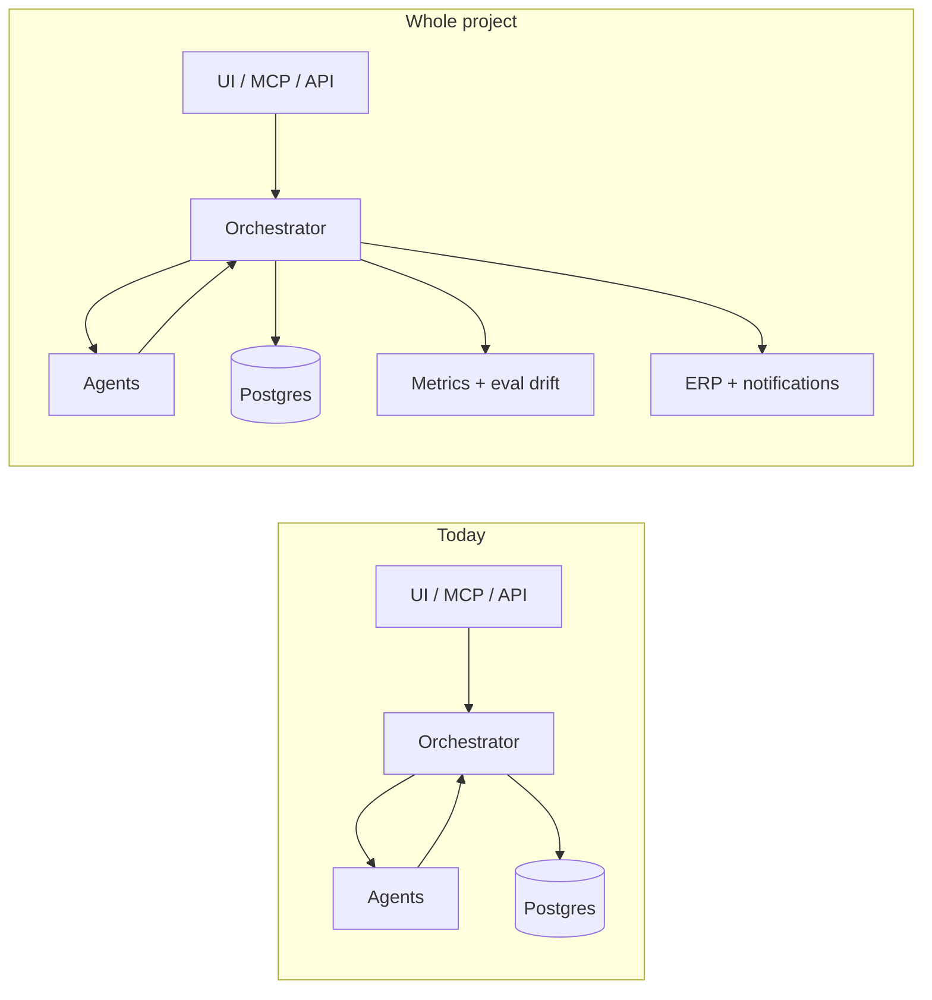

# Post–Phase 1 product review — whole-project roadmap

| Field | Value |
|-------|--------|
| **Status** | Reference (post-showcase planning) |
| **Audience** | Implementation, portfolio narrative, hiring demos |
| **Last updated** | 2026-06-02 |
| **Related** | [`agentic-v2-implementation-plan.md`](./agentic-v2-implementation-plan.md) · [`../docs/production-roadmap.md`](../docs/production-roadmap.md) · [`../STRATEGY.md`](../STRATEGY.md) |

---

## Executive assessment

ReconAI is a credible **Phase 1 operator product**, not a take-home script. The hard parts are in place: orchestration, fail-safe autonomy, eval discipline, operator UI, MCP/API parity, async ingest, and tenant isolation.

To feel like a **whole project** (something you ship, sell, or maintain for 12 months), gaps are less “missing a chatbot” and more:

- **Closed loops** in the UI (card ↔ invoice, policy inbox, month-close view)
- **Integration test proof** for capstone invariants
- **One real external integration** depth (ERP post or receipt chase beyond mock)
- **Doc / CI hygiene** so reviewers trust the codebase matches the narrative

### Maturity snapshot

| Dimension | Assessment | Notes |
|-----------|------------|-------|
| **Architecture** | Strong | Single orchestrator; agents return payloads only; audit/events; tenant isolation |
| **Hero workflow (tagging)** | Strong | Tri-state, rules, RAG, eval harness + CI gate, HITL, vendor learning |
| **Operator UX** | Good | Review queue, txn detail + trace, policy admin, settings, async ingest |
| **Policy / AP** | Thin but real | Receipt gate works; AP recommend-only by design |
| **Production ops** | Good POC | CI, E2E, RLS, API keys, async + dead-letter, Vercel deploy |
| **Test depth** | Weak spot | Gates/policy well covered; core tagging path + orchestrator integration undertested |
| **Docs / narrative** | Mixed | Strong README; `STRATEGY.md` / `product-roadmap.md` can drift from shipped code |

---

## What’s working well (keep leaning in)

1. **Fail-safe autonomy** — `REFUSE` / `QUEUE_REVIEW` over silent wrong GL is the right product bet; evals prove it.
2. **Eval as a product feature** — 30-case harness + baseline gate is rare in portfolio projects; credibility anchor.
3. **Agent-native design** — MCP + API mirror UI (`ingest`, `override`, `reprocess`, `review_queue`).
4. **Cross-workflow spine** — Policy → receipt gate → tagging → ERP → AP is architecturally honest.
5. **Trace / run history UX** — Pipeline modal, run history, handoff labels make the orchestrator legible in demos.

---

## Critical improvements (do first)

These are not flashy features; they make the project **trustworthy**.

### 1. Integration tests for platform invariants

| Test | Why |
|------|-----|
| Happy path: ingest → `AUTO_TAG` with vendor rule | Proves end-to-end orchestrator |
| `REFUSE` on unknown vendor | Proves safety contract |
| Receipt gate blocks `AUTO_TAG` without `cleared_at` | Proves W2 gates W1 |
| Cross-tenant: tenant-a rule never tags tenant-b txn | Isolation beyond RLS unit test |

**Target files:** `src/lib/orchestrator/run-pipeline.ts`, `src/lib/orchestrator/gates.ts`, receipt status helpers.

**Existing coverage:** `tests/integration/tenant-rls.test.ts`, `tests/integration/vendor-rule-learning.test.ts` — extend, don’t replace.

### 2. Unit test the confidence scorer

`src/lib/confidence/scorer.ts` drives `AUTO_TAG` vs review vs refuse. No dedicated unit tests today — one regression breaks the product promise.

### 3. CI hygiene

| Item | Current gap |
|------|-------------|
| `pnpm lint` in CI | Script exists; not in `.github/workflows/ci.yml` |
| Node / pnpm versions | `package.json` expects Node ≥22, pnpm 10; CI may pin older |
| Agentic eval on `develop` | `AGENTIC_EVIDENCE_ENABLED=true` eval gate on develop PRs |

### 4. Consolidate docs

| Action | Why |
|--------|-----|
| Refresh `STRATEGY.md` | Still lists capabilities that P4 has shipped (e.g. QuickBooks) |
| Reconcile `docs/product-roadmap.md` vs `docs/production-roadmap.md` | Avoid “Planned” on shipped SSO/RLS/eval gate |
| Add or remove `docs/schedule.md` references | Cursor rules reference a missing file |

### 5. Controller-facing observability

Langfuse + SLO panel exist. A **read-only dashboard** (autonomy rate, cost/run, eval drift, queue depth) from `audit_log` / `events` completes the CFO persona in `STRATEGY.md`.

---

## Feature tiers — “whole project”

### Tier A — Complete the product narrative (highest impact)

Turn three workflows into **one story a CFO understands**.

| Feature | What to build | Why it matters |
|---------|---------------|----------------|
| **Card txn ↔ invoice link** | Shared `vendor_id` UI: txn detail → related invoices; AP → related card spend | Makes “one platform” tangible |
| **Tri-state UI testing guide** | Done — [`docs/guides/ui-testing-tri-state.md`](../docs/guides/ui-testing-tri-state.md) | Step-by-step AUTO_TAG / QUEUE_REVIEW / REFUSE in browser |
| **Month-close dashboard** | `/close` or home widget: % auto-tagged, queue size, policy flags, oldest unreviewed | Staff accountant + controller daily view |
| **Policy outcome inbox** | Separate from review queue: `FLAG_RECEIPT`, cap breaches, banned category + actions | W2 feels like a product, not a gate |
| **Bulk review actions** | Multi-select in review queue: approve, assign GL, export CSV | Real ops teams batch work |
| **Eval drift alert** | Settings or CI webhook when `pass_rate` drops vs baseline | Treat ML like software |

### Tier B — Production depth (deployable)

| Feature | Notes |
|---------|-------|
| **Xero OAuth** | P4 has QuickBooks; Xero completes “real ERP” for non-US reviewers |
| **Real receipt chase** | Replace mock in `src/lib/notifications/receipt-chase.ts` with Resend or Slack API |
| **Global rate limiting** | Upstash Redis — today per-instance only (`docs/security.md`) |
| **Async reprocess + live SSE** | Return `run_id` immediately; modal streams trace during background reprocess |
| **Hybrid retrieval (BM25 + vector)** | When live-embedding recall@5 slips; metric already in eval |
| **Invoice ↔ txn duplicate / match** | AP sees same-vendor card spend + open invoice |

### Tier C — Agentic v2 → product (post-showcase)

Shipped on `develop` behind `AGENTIC_EVIDENCE_ENABLED`. See [`agentic-v2-implementation-plan.md`](./agentic-v2-implementation-plan.md).

| Item | Action |
|------|--------|
| Merge policy | Cherry-pick or full merge to `main` after showcase; flag default **off** in prod |
| `AGENTIC_VERIFIER_LLM` | Optional LLM verifier — document cost/latency tradeoff |
| Planner live path | CI eval uses planner fallback when `LLM_ENABLE_LIVE_CALLS=false`; add mock planner tests + optional live eval subset |
| LangGraph restructure (Phase 2b) | Extract `planEvidence` node only if trace/debug complexity hurts |
| Eval vendor-rule sync | Done — `scripts/lib/tenant-seed-config.ts` restores seed rules before eval |

### Tier D — Enterprise polish (portfolio / hiring signal)

| Feature | Signal |
|---------|--------|
| **Role-based UI** | Clerk RBAC exists — hide policy compile from `viewer`, etc. |
| **Audit export** | CSV/JSON export of `audit_log` by `run_id` |
| **Tenant onboarding wizard** | CoA CSV import, vendor aliases, first API key |
| **MCP integration tests** | Smoke each of 11 tools against test DB |
| **OpenAPI / SDK** | Generated spec from Zod route schemas |

---

## Architectural improvements (maturity, not features)

1. **Domain events as product** — Expose tenant timeline from `events`, not only per-txn activity.
2. **Idempotency everywhere** — Document + test reprocess, override, webhook replay like ingest keys.
3. **Feature flags in Settings** — `AGENTIC_EVIDENCE_ENABLED`, `LLM_ENABLE_LIVE_CALLS` with “what changes” copy.
4. **Demo vs eval tenants** — Eval syncs seed vendor rules; consider `DEMO_TENANT` slug where learned rules persist for live demos.

---

## Scope traps — do not add early

Per product invariants — bigger ≠ more whole:

| Out of scope (for now) | Reason |
|------------------------|--------|
| Payment execution / dual-control payouts | Recommend-only until compliance design |
| LangGraph/CrewAI rewrite for linear pipeline | YAGNI |
| Fine-tuning pipeline | Rules + RAG sufficient for POC |
| Full receipt OCR | Mock upload + checkbox enough until P4+ |
| Separate vector DB | pgvector suffices |

---

## Recommended build order (8–12 weeks post-showcase)

| Week | Focus |
|------|-------|
| 1 | Integration tests (receipt gate, REFUSE, happy path) + CI lint / Node alignment |
| 2 | Doc consolidation + Controller dashboard (read-only metrics) |
| 3 | Card ↔ invoice linking + policy outcome inbox |
| 4 | Async reprocess SSE + bulk review actions |
| 5–6 | Xero **or** real receipt chase (one integration depth) |
| 7 | Merge agentic v2 to `main` (flag off) + eval subset for planner |
| 8+ | OpenAPI, MCP tests, tenant onboarding |

---

## One-line pitch (target narrative)

> **ReconAI** is an event-driven financial ops platform: policy gates card spend, a rule-first + RAG tagging agent codes GL with tri-state autonomy and full audit replay, learned vendor rules reduce LLM cost over time, and AP recommends pay timing on the same vendor graph — exposed via UI, API, and MCP with eval-gated releases.

**~70% of this sentence is shipped today.** The remaining **30%** is closed UI loops, integration test proof, and one non-mock external integration.

---

## Immediate phase (showcase freeze)

Before new features:

1. `pnpm showcase:prep` green (`eval:tagging` + `eval:gate`)
2. Dry-run demo Options B + D + E — [`docs/demo-script.md`](../docs/demo-script.md)
3. Record backup demo video
4. Vercel `develop` preview with `AGENTIC_EVIDENCE_ENABLED=true` for agentic story

**After showcase:** start with **Critical improvements §1–3**, then **Tier A**.

---

## Key code references

| Concern | Path |
|---------|------|
| Orchestrator | `src/lib/orchestrator/run-pipeline.ts` |
| Gates | `src/lib/orchestrator/gates.ts` |
| Confidence | `src/lib/confidence/scorer.ts` |
| Tagging agent | `src/lib/agents/tagging/run-tagging-agent.ts` |
| Agentic v2 | `evidence-planner.ts`, `evidence-verifier.ts`, `evidence-policy.ts` |
| Eval harness | `scripts/run-tagging-eval.ts`, `eval/tagging_eval.jsonl` |
| Seed / eval drift fix | `scripts/lib/tenant-seed-config.ts` |
| Production phases | `docs/production-roadmap.md` |

---

*Reviewer feedback captured 2026-06-02. Update when a tier item ships — same PR as the feature.*
